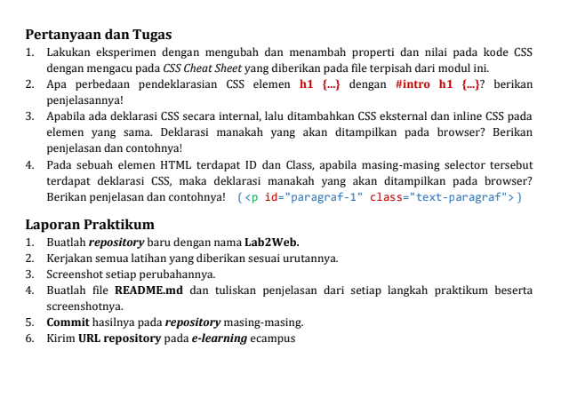
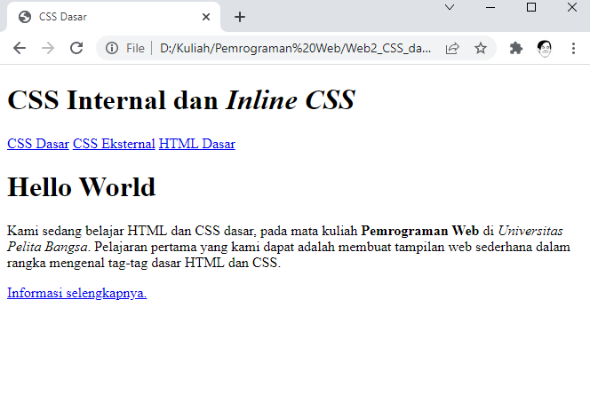

## CSS Dasar

**Nama     : Fery Affandi**  
**Kelas    : TI.20.A.1**   
**NIM      : 312010018**  

## Tugas

Mendapatkan tugas dari dosen Pemrograman Web pada pertemuan ke-2 ,yaitu:

# Langkah-langkah praktikum

## 1. Membuat dokumen HTML

Buatlah dokumen HTML seperti dibawah ini.

    <!DOCTYPE html>
    <html lang="en">
    <head>
        <meta charset="UTF-8">
        <meta name="viewport" content="width=device-width, initial-scale=1.0">
        <title>CSS Dasar</title>
    </head>
    <body>
        <header>
            <h1>CSS Internal dan <i>Inline CSS</i></h1>
        </header>
        <nav>
            <a href="lab2_css_dasar.html">CSS Dasar</a>
            <a href="lab2_css_eksternal.html">CSS Eksternal</a>
            <a href="lab1_tag_dasar.html">HTML Dasar</a>
        </nav>
        <!-- CSS ID Selector -->
        

            <h1>Hello World</h1>
            
Kami sedang belajar HTML dan CSS dasar, pada mata kuliah <b>Pemrograman
    Web</b> di <i>Universitas Pelita Bangsa</i>. Pelajaran pertama yang kami dapat
    adalah membuat tampilan web sederhana dalam rangka mengenal tag-tag dasar HTML
    dan CSS.

            <!-- CSS Class Selector -->
            <a class="button btn-primary" href="#intro">Informasi selengkapnya.</a>
        

    </body>
    </html>

Selanjutnya buka file HTML pada browser.

